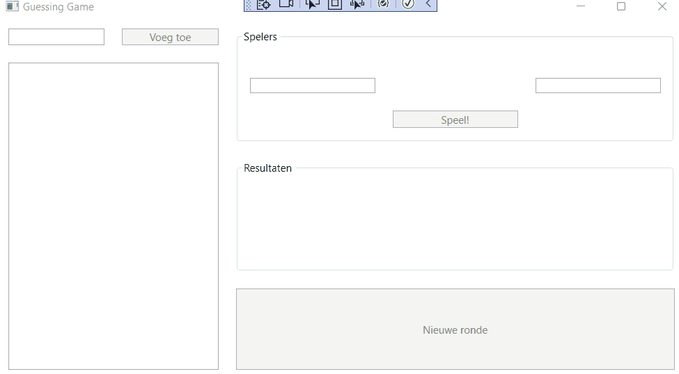

# PE2: Raadspel

Voor deze tweede opdracht programmeer je een gokspel voor een willekeurig aantal spelers. Bij het opstarten ziet de applicatie er als volgt uit:


## Spelverloop

Links heb je een paneel waar je een listbox met alle spelers hebt. Spelers kunnen toegevoegd worden via de `btnAddName` knop. Deze is niet geactiveerd als het tekstvak ernaast leeg is.

Eens er minstens twee spelers zijn wordt de knop `btnPlay` actief en kan er een nieuwe ronde gestart worden. Een ronde bestaat uit de volgende stappen:

- Er worden twee willekeurige spelers uit de spelerslijst gekozen, deze komen terecht in `lblFirstPlayerName` en `lblSecondPlayerName`
- Beide spelers kiezen een getal tussen 0 en 100 en vullen het in in `txtFirstPlayerGuess` en `txtSecondPlayerGuess`
- Daarna moet op de knop `btnPlay` geklikt worden

Na het klikken op deze knop wordt gecontroleerd of beide spelers getallen tussen 0 en 100 ingegeven hebben, wanneer dit niet zo is wordt de boodschap `Ongeldige invoer` getoond aan de gebruikers.

- De computer kiest vervolgens drie willekeurige getallen en voor elk van die drie getallen wordt er bepaald welke speler er het meest het dichtst bij zit. Het resultaat van deze procedure komt terecht in `lblRseult`

- De persoon die er het vaakst het dichts bij zat, is de winnaar. Als de winnaar in de listbox lager stond dan de verliezer, wisselen zij van plaats in de listbox.
- Daarna kan er een nieuwe ronde gestart worden waarbij er opnieuw twee willekeurige spelers gekozen worden.

## Voorbeeld



We voegen de spelers `Dieter`, `Dries` en `Jan` toe aan de listbox.

### Eerste ronde

1. De computer selecteert random de spelers `Dieter` en `Jan`.
2. Dieter kiest voor het getal `25` en Jan voor het getal `75`.
3. De computer kiest de getallen `86`, `45` en `40`.
4. Dieter zit er twee keer het dichtst bij (`45` en `40`), Jan 1 keer (`86`).
5. Dieter wint, maar aangezien hij al bovenaan de listbox staat, verandert er niets aan de ranking.

### Tweede ronde

1. De computer selecteert random de spelers `Jan` en `Dries`.
2. Jan kiest voor het getal `50` en Dries voor het getal `8`.
3. De computer kiest de getallen `5`, `70` en `86`.
4. Jan zit er twee keer het dichtst bij (`70` en `86`), Dries 1 keer (`5`).
5. Jan wint, en aangezien hij lager dan `Dries` staat in de ranking, verwisselen `Jan` en `Dries` van plaats..

### Derde ronde

1. De computer selecteert random de spelers `Dries` en `Dieter`.
2. Dries kiest voor het getal `41` en Dieter voor het getal `98`.
3. De computer kiest de getallen `74`, `30` en `56`.
4. Dries zit er twee keer het dichtst bij (`30` en `56`), Dieter 1 keer (`74`).
5. Dries wint, en aangezien hij onder `Dieter` staat in de ranking, wisselen ze van plaats.

## Extra opmerkingen

Spelers kunnen op ieder moment toegevoegd worden, ze komen dan gewoon achteraan de lijst terecht.

Een random speler uit een lijst van lengte 5 halen, kun je doen door een random getal tussen `0` en `5` te bepalen, en vervolgens op die index in de lijst kijken.

Probeer er voor te zorgen dat er altijd twee verschillende spelers gekozen worden in een ronde. Dit kun je doen door twee random spelers te blijven kiezen tot ze verschillend zijn.

Om het verschil te bepalen tussen twee getallen `firstNumber` en `secondNumber` kun je gebruik maken van de volgende code. Deze zal werken als `firstNumber` groter is dan `secondNumber` EN als `firstNumber` kleiner is dan `secondNumber`.

```csharp
int difference = Math.Abs(firstNumber - secondNumber);
```

Probeer zoveel mogelijk hard gecodeerde getallen te vermijden in de methodes. Maak hier constante variabelen voor aan.

Maak zoveel mogelijk gebruik van methodes, lussen en arrays/collecties.